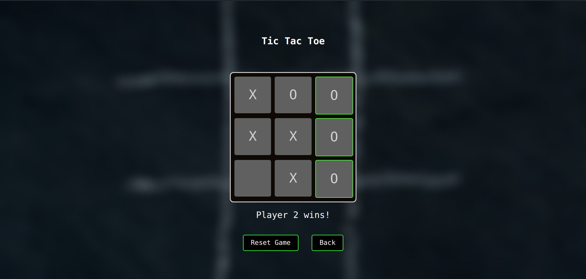
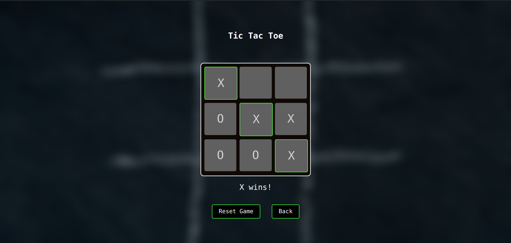

# Tic-Tac-Toe Game

The Tic-Tac-Toe Game is a classic two-player game where players take turns marking spaces in a 3x3 grid with their respective symbols (usually X and O). The objective of the game is to be the first player to form a horizontal, vertical, or diagonal line of their symbol.

## Features

- **Single Player Mode**: Play against an AI (Artificial Intelligence) opponent.
- **Two Players Mode**: Compete against another player on the same device.

In the **Single Player Mode**, the player faces off against an AI opponent programmed to make strategic moves. The AI aims to provide a challenging gaming experience by employing various algorithms to determine its moves.

In the **Two Players Mode**, two players take turns playing the game on the same device. Each player can make their moves by tapping on the desired grid space.

## Getting Started

To play the Tic-Tac-Toe Game, simply follow these steps:

1. Choose the desired game mode (Single Player or Two Players).
2. If playing in Single Player mode, select the difficulty level of the AI opponent.
3. Start the game and take turns marking spaces with your symbol.
4. The game ends when one player successfully forms a line of their symbol or when all spaces are filled without a winner.

## Technologies Used

The Tic-Tac-Toe Game is developed using:

- **HTML**: For the structure of the game interface.
- **CSS**: For styling the game elements and layout.
- **JavaScript**: For implementing the game logic and interactivity.

## Demo

