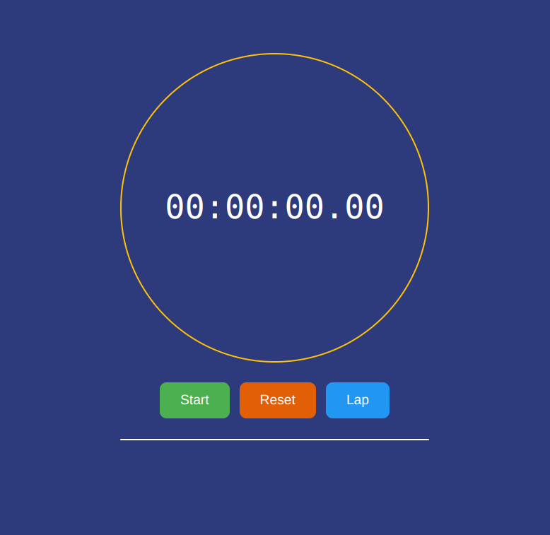
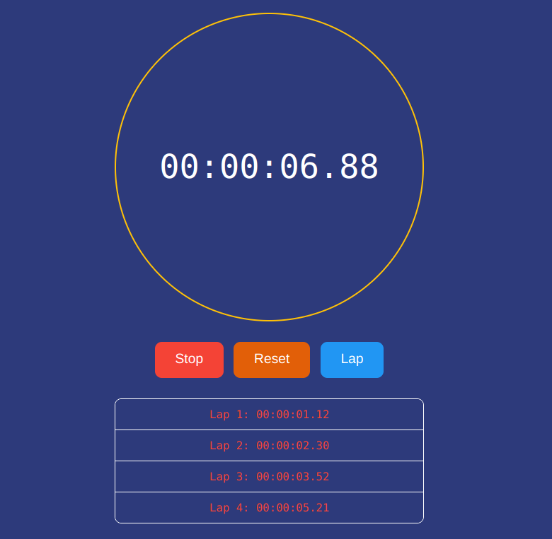

# Description:

The stopwatch app is a web application that allows users to measure time intervals accurately. It is built using HTML, CSS, and JavaScript, making it compatible with modern web browsers.

The HTML structure of the app includes a display area to show the elapsed time, along with buttons for starting, pausing, and resetting the stopwatch. The CSS styling is used to enhance the visual appearance of the app, making it user-friendly and visually appealing.

The JavaScript code is responsible for the functionality of the stopwatch. It utilizes the Date object and event listeners to track the elapsed time accurately. When the user clicks the start button, the stopwatch begins counting the time. The pause button allows the user to temporarily stop the stopwatch, while the reset button resets the stopwatch to zero.

Overall, the stopwatch app provides a simple and intuitive way for users to measure time intervals. It demonstrates the power of HTML, CSS, and JavaScript in creating interactive and functional web applications.

# App:

 

